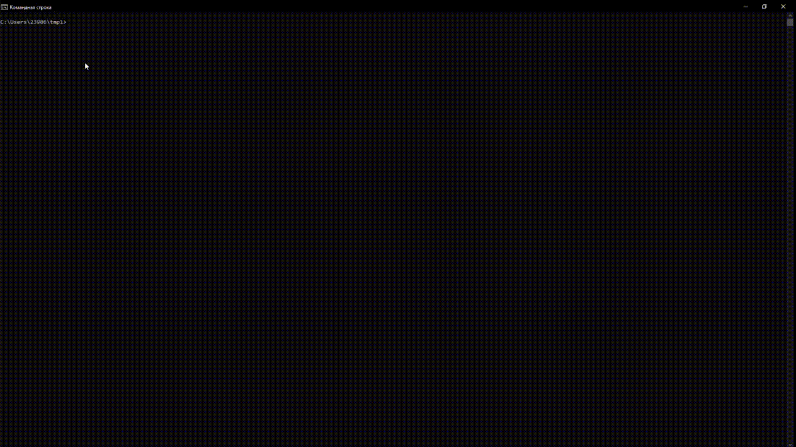
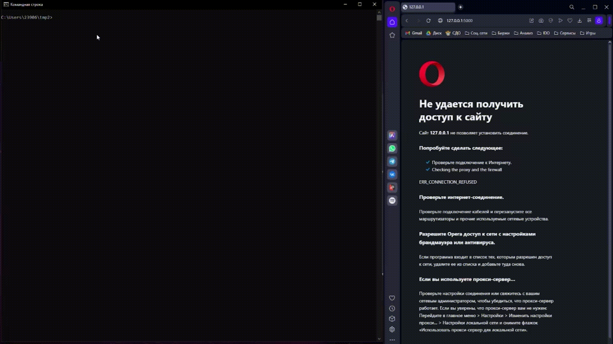

> # Документация
>> ## Windows
>>> ### Требования
>>> - Python3.9+
>>> - Make
>>> - Git
>>> ### Сборка
>>> Сборка для Windows осуществляется с помощью команды
>>> `make windows`
>>> 
>> ## Linux
>>>  Требования
>>> - Make
>>> - Git
>>> ### Сборка
>>> Сборка для Linux осуществляется с помощью команды
>>> `make linux`
>>> 
>> ## Web
>>>  Требования
>>> - Python3.9+
>>> - Make
>>> - Git
>>> - Flask
>>> ### Сборка
>>> Сборка для Web осуществляется с помощью команды
>>> `make web`
>>> 
>>> ## NetBSD
>>>  Требования
>>> - Make
>>> - Git
>>> ### Сборка
>>> Сборка для NetBSD осуществляется с помощью команды
>>> `make netBSD`
>>> 
>>> ## Тестирование