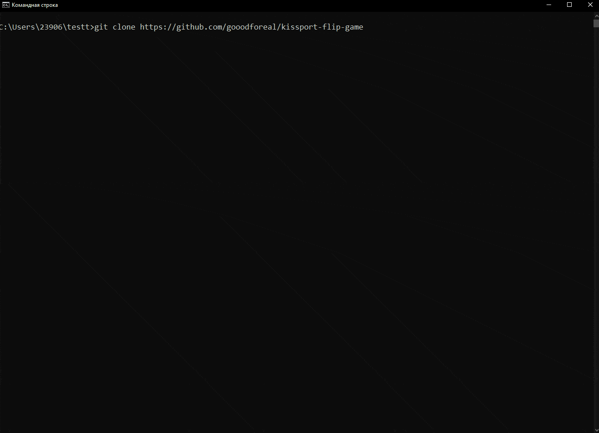
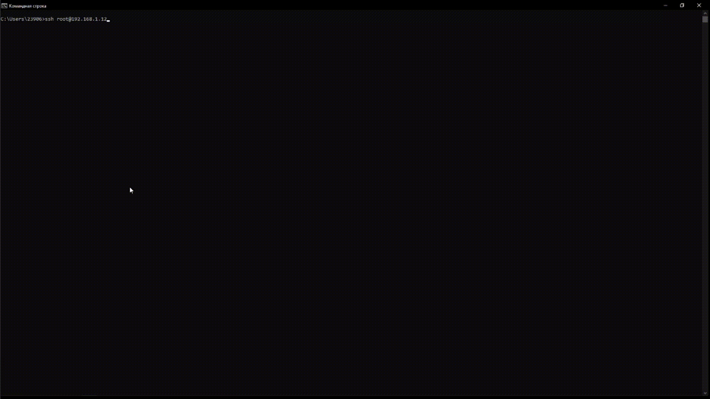
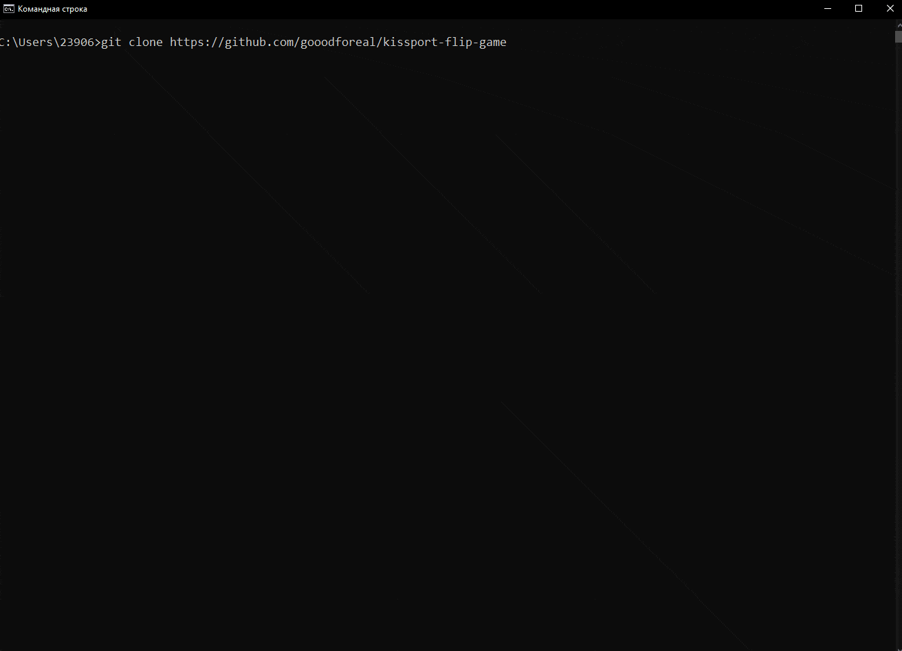
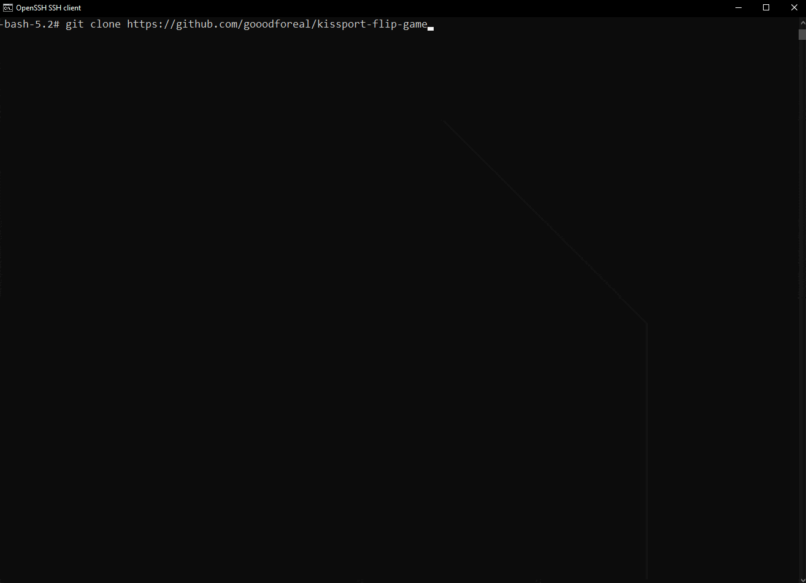

> # Документация
>> ## Описание проекта
>> Исходный код игры, написанный на Бейсике был переписан на Python. 
>> Игра реализована в переносимом стиле так, что ее можно запустить на разных ОС
>> с помощью утилиты make используя инструкцию, представленную ниже.
>> 
>> Исходный код игры был взят [отсюда](https://www.roug.org/retrocomputing/languages/basic/morebasicgames).
>> ## Windows
>>> ### Требования
>>> - Python3.9+
>>> - Make
>>> - Git
>>> ### Сборка
>>> Сборка для Windows осуществляется с помощью команды
>>> `make windows`
>>> 
>> ## Linux
>>>  Требования
>>> - Make
>>> - Git
>>> ### Сборка
>>> Сборка для Linux осуществляется с помощью команды
>>> `make linux`
>>> 
>> ## Web
>>>  Требования
>>> - Python3.9+
>>> - Make
>>> - Git
>>> ### Сборка
>>> Сборка для Web осуществляется с помощью команды
>>> `make web`
>>> 
>>> ## NetBSD
>>>  Требования
>>> - Make
>>> - Git
>>> ### Сборка
>>> Сборка для NetBSD осуществляется с помощью команды
>>> `make netBSD`
>>> 
>>> ## Тестирование
>>> Тестирование производится автоматизированно в файле test.py. Для тестирования запускаются два парралельных процесса: 
>>> Исходник игры на BASIC и клон, реализованный на Python.
>>> Для того, чтобы была возможность автоматизации тестирования в тестируемых файлах был удален рандом. 
>>> В связи с этим игра выдает не совсем коректные результаты.